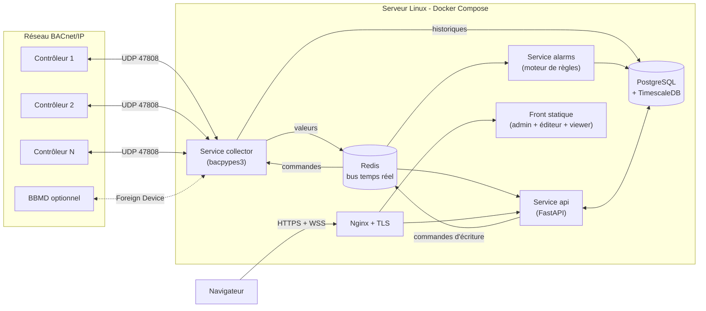
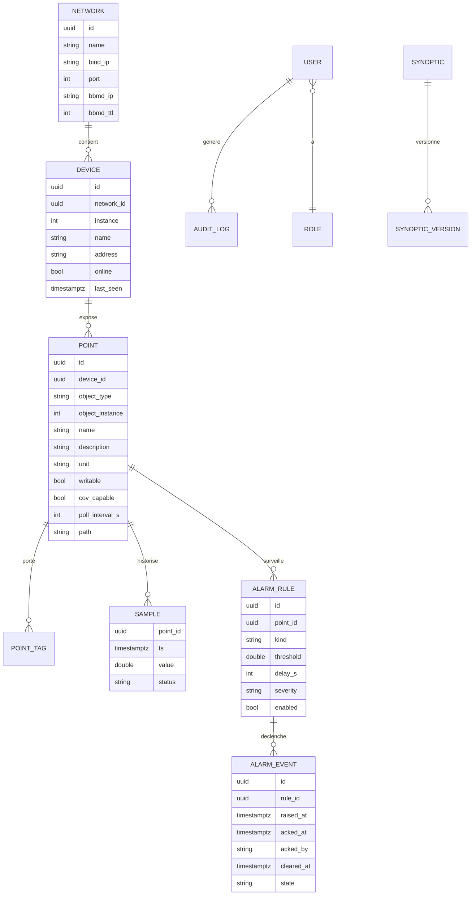
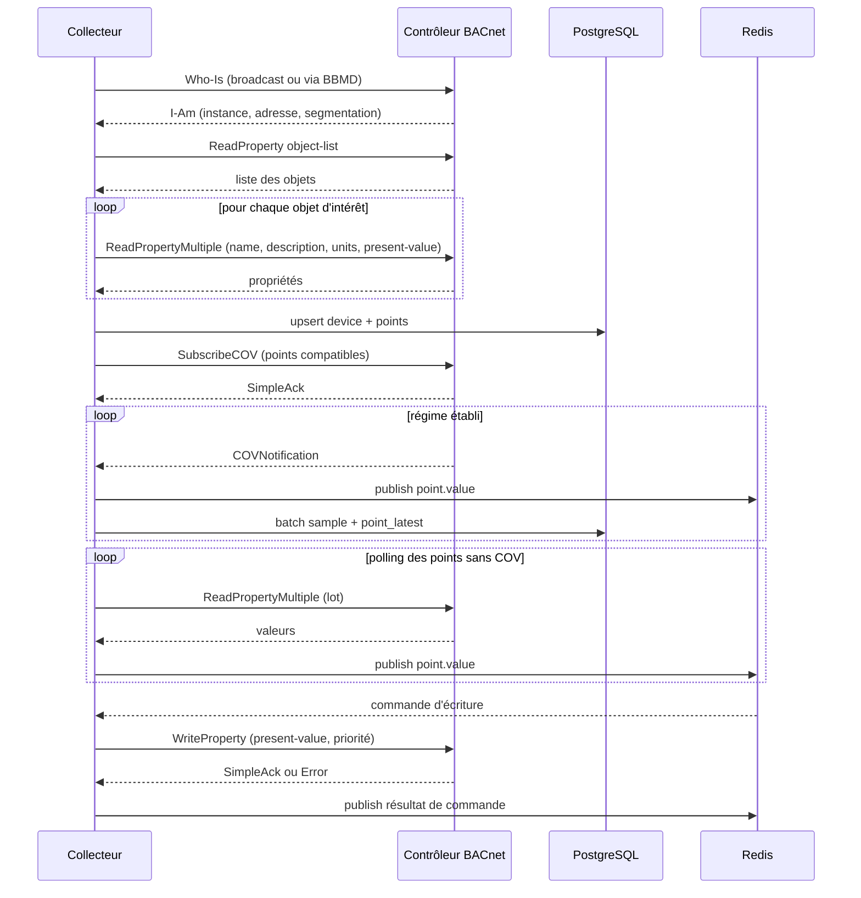
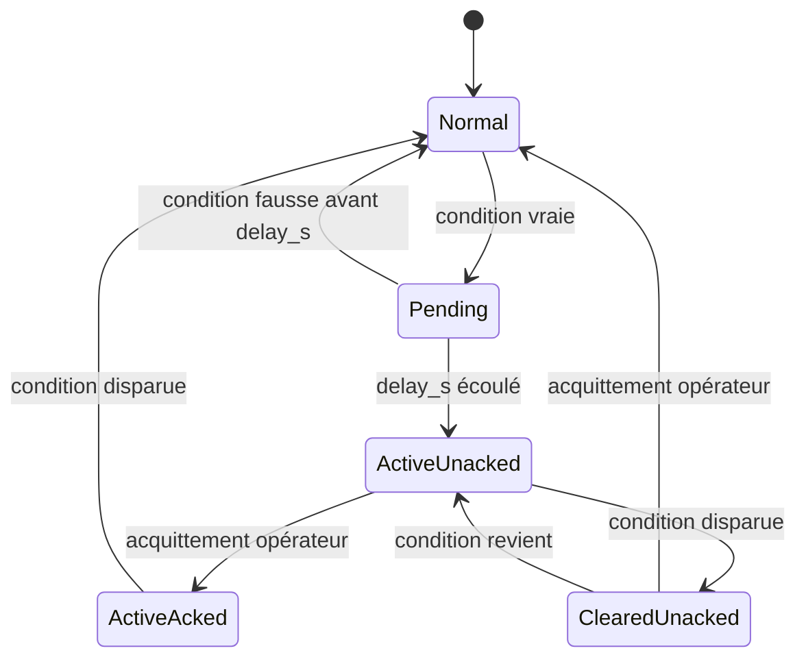
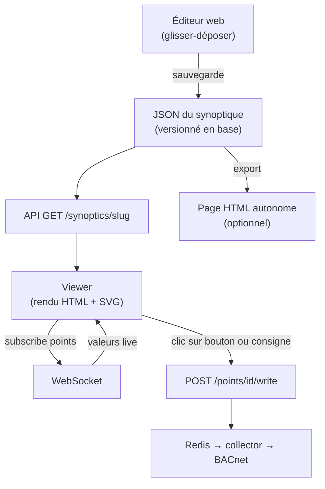
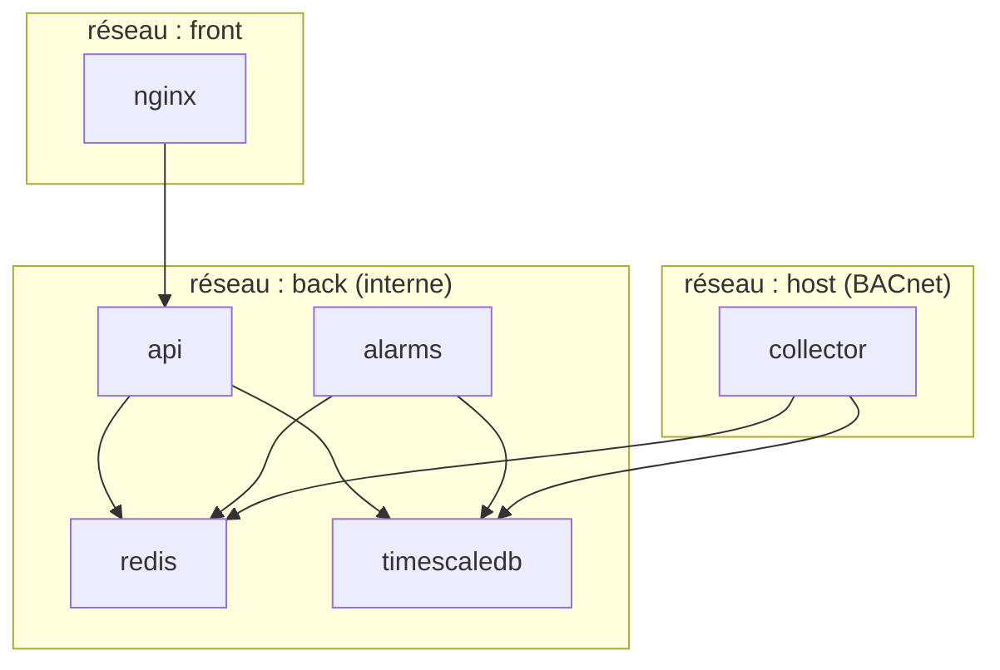

# Cahier des charges : Superviseur BACnet/IP (type Niagara) sous Linux

> Document destiné à Claude Code. À placer à la racine du dépôt sous le nom `SPEC.md`, avec un `CLAUDE.md` court qui renvoie vers lui.

---

## 0. Règles de travail pour Claude Code

1. Lire ce document en entier avant d'écrire du code.
2. Travailler **jalon par jalon** (section 15). Ne pas commencer le jalon N+1 tant que les critères d'acceptation du jalon N ne passent pas.
3. Chaque jalon se termine par : tests verts, `docker compose up` fonctionnel, README mis à jour.
4. Ne jamais inventer un comportement non décrit ici : ajouter la question dans `docs/QUESTIONS.md` et choisir l'option la plus simple.
5. Toute la configuration passe par variables d'environnement ou fichiers YAML. Aucun secret dans le dépôt.
6. Code typé (mypy strict côté Python), formaté (ruff), commenté en français, identifiants de code en anglais.
7. Aucun code ni protocole propriétaire Tridium (Fox, etc.). Système 100 % ouvert.

---

## 1. Objectif

Fournir un superviseur GTB (gestion technique du bâtiment) qui :

- découvre et lit **environ 2000 points BACnet/IP** ;
- historise les valeurs ;
- gère les alarmes ;
- permet de **créer des superviseurs (synoptiques) en HTML** depuis un éditeur web, servis en direct par le serveur ;
- permet d'écrire des consignes avec priorité BACnet ;
- tourne sur un serveur Linux via Docker Compose.

### Hors périmètre (v1)

- Autres protocoles (Modbus, OPC UA, MQTT) : prévoir l'interface `Driver` pour les ajouter plus tard.
- Programmation graphique type Wire Sheet, horaires BACnet (Schedule), calendriers.
- Haute disponibilité multi-serveurs.
- Application mobile native (le web doit être responsive).

---

## 2. Stack imposée

| Couche | Choix |
|---|---|
| Langage backend | Python 3.12 |
| BACnet | `bacpypes3` (asyncio) |
| API | FastAPI + Uvicorn, WebSocket natif |
| ORM / migrations | SQLAlchemy 2 (async) + Alembic |
| Base | PostgreSQL 16 + TimescaleDB |
| Bus interne | Redis 7 (pub/sub + streams) |
| Front | TypeScript + Vite, sans framework lourd pour le rendu des synoptiques (SVG + JS natif), React autorisé pour l'admin |
| Graphiques | uPlot (courbes) |
| Reverse proxy | Nginx + TLS |
| Déploiement | Docker Compose |
| Tests | pytest, pytest-asyncio, Playwright (front) |

---

## 3. Architecture générale



**Principe** : le collecteur est le **seul** composant qui parle BACnet. Tout le reste passe par Redis et la base. Une écriture de consigne suit le chemin inverse : navigateur → API → Redis → collecteur → contrôleur.

---

## 4. Arborescence du dépôt

```
supervisor/
├── SPEC.md
├── CLAUDE.md
├── docker-compose.yml
├── .env.example
├── deploy/
│   ├── nginx/nginx.conf
│   └── backup/backup.sh
├── backend/
│   ├── pyproject.toml
│   ├── alembic/
│   └── app/
│       ├── common/          # config, logging, modèles Pydantic partagés
│       ├── db/              # modèles SQLAlchemy, session
│       ├── collector/       # service BACnet
│       │   ├── main.py
│       │   ├── driver_base.py     # interface Driver
│       │   ├── bacnet_driver.py
│       │   ├── discovery.py
│       │   ├── poller.py
│       │   ├── cov.py
│       │   ├── writer.py
│       │   └── normalizer.py
│       ├── alarms/          # service alarmes
│       ├── api/             # routes FastAPI
│       └── auth/
├── frontend/
│   ├── src/
│   │   ├── admin/           # équipements, points, alarmes, utilisateurs
│   │   ├── editor/          # éditeur de synoptiques
│   │   ├── viewer/          # rendu live
│   │   └── widgets/         # un dossier par widget
│   └── tests/
├── simulator/               # simulateur BACnet (voir section 14)
└── docs/
    └── QUESTIONS.md
```

---

## 5. Modèle de données



### 5.1 Tables SQL (à implémenter via Alembic)

- `network(id, name, bind_ip, port, bbmd_ip, bbmd_ttl)`
- `device(id, network_id, instance, name, address, online, last_seen, vendor, model)` avec unicité `(network_id, instance)`
- `point(id, device_id, object_type, object_instance, name, description, unit, writable, cov_capable, poll_interval_s, path)` avec unicité `(device_id, object_type, object_instance)` ; `path` = chemin logique type `Site/Batiment/Etage/Equipement/Point`
- `point_tag(point_id, tag)` (tags de type Haystack : `temp`, `sensor`, `setpoint`…)
- `sample(point_id, ts, value, status)` : **hypertable TimescaleDB** partitionnée sur `ts`, chunk de 1 jour, compression après 7 jours, rétention configurable (défaut 2 ans)
- `point_latest(point_id, ts, value, status)` : dernière valeur (mise à jour par le collecteur, lue par l'API)
- `alarm_rule`, `alarm_event` (voir section 9)
- `synoptic(id, name, slug, owner_id)` et `synoptic_version(id, synoptic_id, version, json, created_by, created_at)`
- `user(id, login, password_hash, role_id, active)` et `role(id, name)`
- `audit_log(id, ts, user_id, action, target, before, after, ip)`

### 5.2 Règles de stockage des échantillons

- Un échantillon est enregistré si : (a) la valeur change de plus que la **deadband** du point, ou (b) le temps depuis le dernier enregistrement dépasse `max_interval` (défaut 15 min).
- Écriture par **lots** (batch de 500 lignes ou 2 s, le premier atteint) via `COPY` ou `executemany`.
- `status` ∈ `ok`, `fault`, `overridden`, `out_of_service`, `stale`, `comm_lost`.

---

## 6. Collecteur BACnet

### 6.1 Configuration (`config/collector.yaml`)

```yaml
network:
  name: "reseau-principal"
  bind_ip: "192.168.1.10/24"
  port: 47808
  device_instance: 599999        # instance du superviseur lui-même
  bbmd:
    enabled: false
    address: "192.168.1.1:47808"
    ttl: 900
discovery:
  who_is_low: 0
  who_is_high: 4194303
  interval_s: 3600
polling:
  default_interval_s: 30
  batch_size: 20                 # propriétés par ReadPropertyMultiple
  max_concurrent_requests: 5
  timeout_s: 5
  retries: 2
cov:
  enabled: true
  lifetime_s: 3600
  renew_before_s: 300
```

### 6.2 Cycle de vie



### 6.3 Exigences détaillées

**Découverte**
- Who-Is sur la plage configurée, réponses dédupliquées par `instance`.
- Lecture de `object-list` : si la lecture complète échoue (segmentation non supportée), lire index par index (`array-index`).
- Types d'objets importés en v1 : `analog-input`, `analog-output`, `analog-value`, `binary-input`, `binary-output`, `binary-value`, `multi-state-input`, `multi-state-output`, `multi-state-value`. Les autres sont ignorés (journalisés en debug).
- Un point est `writable` si son type est `*-output` ou `*-value`.
- La découverte **ne supprime jamais** un point : elle le marque `missing` s'il disparaît, la suppression est manuelle.

**Polling**
- Regroupement des lectures par device, en ReadPropertyMultiple, taille de lot configurable, repli sur ReadProperty si le device ne supporte pas RPM.
- Un point sans réponse après `retries` passe en `status = comm_lost` ; le device passe `online = false` après 3 cycles consécutifs sans réponse.
- Répartition (jitter) des cycles pour éviter les rafales : les 2000 points ne sont pas tous lus à la même seconde.
- Limite de requêtes simultanées par device : 1 (les contrôleurs sont souvent faibles).

**COV**
- Abonnement uniquement si le device le supporte (lecture de `protocol-services-supported`).
- Renouvellement automatique avant expiration ; si le renouvellement échoue, repli sur polling.
- Même avec COV, un polling de sécurité toutes les 5 min détecte les valeurs figées.

**Écriture**
- Commande reçue via Redis : `{command_id, point_id, value, priority (1..16), user_id}`.
- Priorité par défaut 8 (opérateur manuel). Valeur `null` = **relâcher** la priorité (écrire Null).
- Refus si le point n'est pas `writable` ou si le rôle de l'utilisateur ne le permet pas (contrôle fait dans l'API, revérifié ici).
- Résultat publié sur Redis (`ok` / `error` + motif) et tracé dans `audit_log`.

**Normalisation** (`normalizer.py`)
- Sortie unique : `{point_id, ts (UTC), value (float), status, raw}`.
- Binaires → 0.0 / 1.0. Multi-états → index entier, avec table de libellés (`state-text`) stockée pour l'affichage.
- Unités BACnet converties en libellé lisible (°C, %, kW, Pa…).

### 6.4 Interface Driver (pour extensions futures)

```python
class Driver(Protocol):
    async def start(self) -> None: ...
    async def stop(self) -> None: ...
    async def discover(self) -> list[DeviceInfo]: ...
    async def read(self, points: list[PointRef]) -> list[Reading]: ...
    async def write(self, point: PointRef, value: float | None, priority: int) -> WriteResult: ...
    def subscribe(self, callback: Callable[[Reading], Awaitable[None]]) -> None: ...
```

---

## 7. Bus Redis

| Canal / stream | Contenu | Producteur → Consommateurs |
|---|---|---|
| `pub: point.value.{point_id}` | `{ts, value, status}` | collector → api (WebSocket), alarms |
| `stream: cmd.write` | commande d'écriture | api → collector |
| `pub: cmd.result.{command_id}` | résultat | collector → api |
| `pub: device.status` | en ligne / hors ligne | collector → api, alarms |
| `pub: alarm.event` | alarme levée/acquittée/effacée | alarms → api (WebSocket) |

Les commandes utilisent un **stream** (persistance, accusé de traitement) ; les valeurs utilisent du pub/sub simple (la valeur courante est aussi dans `point_latest`).

---

## 8. API

Base : `/api/v1`. Auth par JWT (cookie HttpOnly) ; documentation OpenAPI auto sur `/api/docs`.

### 8.1 Endpoints REST

| Méthode | Route | Rôle minimal | Description |
|---|---|---|---|
| POST | `/auth/login` `/auth/logout` | public | connexion |
| GET | `/networks` `/devices` `/devices/{id}` | viewer | équipements |
| GET | `/points?path=&tag=&device=&q=` | viewer | recherche paginée |
| GET | `/points/{id}` | viewer | fiche + dernière valeur |
| GET | `/points/{id}/history?from=&to=&bucket=` | viewer | série (agrégation `time_bucket`) |
| POST | `/points/{id}/write` | operator | `{value, priority}` ; `value: null` relâche |
| GET | `/alarms?state=` | viewer | alarmes |
| POST | `/alarms/{id}/ack` | operator | acquittement |
| CRUD | `/alarm-rules` | engineer | règles |
| CRUD | `/synoptics` | engineer (écriture), viewer (lecture) | synoptiques |
| GET | `/synoptics/{slug}/versions` | engineer | historique de versions |
| POST | `/synoptics/{id}/restore/{version}` | engineer | restauration |
| CRUD | `/users` `/roles` | admin | utilisateurs |
| GET | `/audit?from=&to=&user=` | admin | journal |
| POST | `/discovery/run` | engineer | relance manuelle |
| GET | `/health` | public | état des services |

### 8.2 WebSocket `/api/v1/ws`

Messages client → serveur :
```json
{"action": "subscribe", "points": ["uuid1", "uuid2"]}
{"action": "unsubscribe", "points": ["uuid1"]}
```
Messages serveur → client :
```json
{"type": "value", "point": "uuid1", "ts": "2026-09-20T10:00:00Z", "value": 21.4, "status": "ok"}
{"type": "alarm", "event": {...}}
```
- Un client ne reçoit que les points auxquels il est abonné.
- À la souscription, envoi immédiat de la dernière valeur connue.
- Limitation : 500 points par connexion, ping/pong toutes les 30 s.

---

## 9. Moteur d'alarmes

### 9.1 Types de règles

| Kind | Description |
|---|---|
| `high` / `low` | seuil haut / bas avec hystérésis |
| `state` | binaire à l'état voulu (ex. défaut = 1) |
| `stale` | pas de nouvelle valeur depuis N secondes |
| `comm_lost` | device hors ligne |
| `bacnet_event` | événement remonté par le contrôleur (Event Notification), si supporté |

Champs communs : `delay_s` (temporisation avant déclenchement), `severity` (`info`, `warning`, `critical`), `notify` (liste de canaux).

### 9.2 Machine à états d'une alarme



### 9.3 Notifications

- Canaux v1 : email (SMTP configurable) et webhook HTTP (JSON).
- Anti-spam : une seule notification par changement d'état ; regroupement si plus de 20 alarmes en 1 minute.
- Chaque transition est écrite dans `alarm_event` avec l'utilisateur pour les acquittements.

---

## 10. Synoptiques HTML

### 10.1 Chaîne de fabrication



### 10.2 Format JSON d'un synoptique

```json
{
  "schema": 1,
  "name": "CTA 1",
  "canvas": { "width": 1920, "height": 1080, "background": "#0f172a", "bg_image": null },
  "widgets": [
    {
      "id": "w1",
      "type": "value",
      "x": 320, "y": 140, "w": 160, "h": 48,
      "bind": { "point": "uuid-du-point", "format": "0.0", "unit": true },
      "style": { "fontSize": 24, "color": "#ffffff" },
      "rules": [
        { "when": "value > 28", "style": { "color": "#ef4444" } },
        { "when": "status != 'ok'", "style": { "opacity": 0.4 } }
      ]
    }
  ],
  "links": [{ "type": "navigate", "widget": "w9", "target": "synoptic:cta-2" }]
}
```

### 10.3 Widgets à fournir (v1)

| Widget | Lecture | Écriture | Notes |
|---|---|---|---|
| `value` | oui | non | valeur formatée + unité |
| `label` | non | non | texte statique |
| `gauge` | oui | non | jauge arc, bornes min/max |
| `indicator` | oui | non | voyant binaire / multi-états avec couleur par état |
| `switch` | oui | oui | commande binaire (avec confirmation) |
| `setpoint` | oui | oui | saisie numérique bornée, priorité configurable |
| `trend` | oui | non | courbe live + historique, jusqu'à 8 points |
| `alarm_list` | oui | ack | tableau des alarmes filtré par chemin |
| `image` | non | non | SVG/PNG en fond ou pictogramme |
| `link` | non | non | navigation vers un autre synoptique |
| `shape` | non | non | rectangle, ligne, tuyau animable (couleur selon règle) |

Chaque widget est un module isolé (`frontend/src/widgets/<nom>/`) avec : `render()`, `update(value)`, `editorSchema` (propriétés éditables), tests.

### 10.4 Éditeur

- Palette de widgets, canevas avec grille et magnétisme, sélection multiple, alignement, copier-coller, annuler/rétablir.
- Panneau de propriétés généré depuis `editorSchema`.
- **Sélecteur de point** : arborescence + recherche par nom/tag, aperçu de la valeur courante.
- Mode « prévisualisation live » sans quitter l'éditeur.
- Sauvegarde = nouvelle version ; restauration possible.
- Import d'un fond SVG/PNG (taille limitée à 5 Mo).

### 10.5 Viewer

- Pas de rechargement de page : une seule connexion WebSocket par synoptique ouvert.
- Mise à jour des widgets par `requestAnimationFrame`, regroupée (pas plus de 10 rendus/s par widget).
- Indication visuelle « connexion perdue » et valeurs grisées si le WebSocket tombe.
- Adaptation à l'écran (échelle proportionnelle du canevas).

---

## 11. Sécurité et droits

| Rôle | Droits |
|---|---|
| `viewer` | lecture des points, synoptiques, alarmes |
| `operator` | viewer + écriture de consignes, acquittement |
| `engineer` | operator + édition synoptiques, règles d'alarmes, découverte |
| `admin` | tout + utilisateurs, audit, configuration |

- Mots de passe : argon2id. Verrouillage temporaire après 5 échecs.
- JWT court (15 min) + refresh (7 jours), cookies `Secure`, `HttpOnly`, `SameSite=Strict`.
- Écritures de consigne : **bornes min/max par point** configurables (refus hors bornes) et journalisation complète.
- Audit : toute écriture, acquittement, modification de règle ou de synoptique, connexion/échec de connexion.
- HTTPS obligatoire côté Nginx ; HSTS ; en-têtes de sécurité (CSP stricte).
- Le port BACnet (UDP 47808) n'est exposé qu'au collecteur, jamais publié sur Internet.

---

## 12. Déploiement

### 12.1 Services Docker Compose



- Le **collecteur utilise `network_mode: host`** (ou macvlan) afin de recevoir les broadcasts BACnet sur le bon sous-réseau.
- Volumes persistants : `pgdata`, `redisdata`, `config/`.
- Healthchecks sur chaque service, `restart: unless-stopped`.
- Sauvegarde : `pg_dump` quotidien vers `/var/backups/supervisor`, rétention 14 jours, script de restauration testé.
- Logs JSON structurés vers stdout ; niveau configurable.
- Un fichier `deploy/supervisor.service` (systemd) démarre `docker compose up -d` au boot.

### 12.2 Variables d'environnement (`.env.example`)

`DATABASE_URL`, `REDIS_URL`, `JWT_SECRET`, `SMTP_HOST/PORT/USER/PASSWORD`, `BACNET_BIND_IP`, `LOG_LEVEL`, `RETENTION_DAYS`.

---

## 13. Exigences non fonctionnelles

| Exigence | Cible |
|---|---|
| Points supportés | 2000 (dimensionner pour 5000) |
| Latence valeur BACnet → affichage navigateur | < 2 s en COV, < intervalle de polling sinon |
| Charge réseau BACnet | < 50 requêtes/s en régime établi |
| Utilisation CPU serveur (4 cœurs) | < 25 % en régime établi |
| Écriture historique | ≥ 2000 échantillons/s en pointe |
| Requête courbe 1 point sur 30 jours | < 1 s |
| Reprise après redémarrage | < 60 s, sans perte de configuration |
| Perte du réseau BACnet | aucun crash, statut `comm_lost`, reprise automatique |
| Couverture de tests backend | ≥ 80 % sur `collector`, `alarms`, `api` |

---

## 14. Simulateur BACnet (indispensable pour les tests)

Claude Code ne peut pas joindre le vrai réseau. Fournir un **simulateur** (`simulator/`) basé sur `bacpypes3` :

- expose **10 devices × 200 points = 2000 points** (mix AI/AO/AV/BI/BO/BV/MSV) ;
- valeurs animées (sinusoïdes, bruit, changements d'état aléatoires) ;
- supporte Who-Is/I-Am, RPM, ReadProperty, WriteProperty avec Priority Array, SubscribeCOV ;
- options de défaut injectable : device muet, latence artificielle, réponse en erreur, absence de RPM, absence de segmentation ;
- lancé par `docker compose --profile sim up`.

Tous les tests d'intégration du collecteur s'exécutent contre ce simulateur.

---

## 15. Jalons et critères d'acceptation

### Jalon 1 : Socle
Livrables : dépôt, Docker Compose (db, redis, api vide), migrations Alembic, CI (ruff, mypy, pytest).
**Acceptation** : `docker compose up` démarre tous les services sains ; `GET /health` renvoie 200 ; migrations appliquées sur base vide.

### Jalon 2 : Simulateur + collecteur
Livrables : simulateur, découverte, import des points, polling RPM, COV, statuts de communication, batch d'historisation.
**Acceptation** (sur simulateur) :
- 2000 points importés en moins de 3 min ;
- toutes les valeurs à jour dans `point_latest` ;
- device coupé → `comm_lost` en moins de 3 cycles, reprise auto au retour ;
- COV : changement de valeur visible en Redis en moins de 2 s ;
- device sans RPM : repli fonctionnel.

### Jalon 3 : API + temps réel + écriture
Livrables : auth, endpoints points/devices/history, WebSocket, écriture avec priorité, audit.
**Acceptation** :
- écriture priorité 8 visible dans le Priority Array du simulateur ; relâchement effectif ;
- écriture refusée pour un `viewer` et pour un point non `writable` ;
- WebSocket : abonnement à 100 points, mises à jour reçues, reconnexion propre.

### Jalon 4 : Historiques et tendances
Livrables : hypertable, compression, deadband, endpoint d'historique agrégé, widget `trend`.
**Acceptation** : requête 30 jours sur 1 point < 1 s avec 2000 points simulés sur 30 jours ; compression active.

### Jalon 5 : Alarmes
Livrables : moteur, machine à états, règles CRUD, acquittement, email/webhook, widget `alarm_list`.
**Acceptation** : chaque type de règle testé (unitaire + intégration simulateur) ; transitions conformes au diagramme 9.2 ; aucune notification en double.

### Jalon 6 : Synoptiques
Livrables : format JSON versionné, éditeur, viewer, widgets de la section 10.3, navigation entre pages.
**Acceptation** (tests Playwright) :
- créer un synoptique de 10 widgets liés à des points, l'enregistrer, le rouvrir ;
- valeurs live à jour dans le viewer ;
- clic sur `switch` → changement visible dans le simulateur ;
- restauration d'une ancienne version ;
- affichage correct sur écran 1920×1080 et sur tablette.

### Jalon 7 : Production
Livrables : Nginx + TLS, rôles complets, verrouillage de compte, sauvegardes, systemd, documentation d'exploitation.
**Acceptation** : audit de sécurité de base (en-têtes, cookies, accès non authentifié refusé) ; restauration d'une sauvegarde testée ; redémarrage complet du serveur sans intervention.

---

## 16. Livrables documentaires

- `README.md` : installation, démarrage, variables.
- `docs/EXPLOITATION.md` : configuration réseau BACnet (sous-réseau, BBMD/Foreign Device), sauvegarde, mises à jour.
- `docs/SYNOPTIQUES.md` : guide de création d'un synoptique.
- `docs/API.md` : généré depuis OpenAPI.
- `docs/QUESTIONS.md` : questions ouvertes rencontrées en cours de route.

---

## 17. Prompt de démarrage à donner à Claude Code

```
Lis SPEC.md en entier. Commence uniquement par le Jalon 1 (Socle).
Avant de coder, propose-moi la liste des fichiers que tu vas créer.
À la fin du jalon, exécute les tests, montre-moi les résultats
et liste les critères d'acceptation validés. N'enchaîne pas sur le
Jalon 2 sans mon accord.
```

## 18. Informations à compléter avant le Jalon 2 (réseau réel)

| Question | Réponse |
|---|---|
| Sous-réseau des contrôleurs | |
| Le serveur est-il sur ce sous-réseau ? | |
| BBMD présent (IP, port) ? | |
| Plage des instances de devices | |
| Points à ignorer (préfixes de noms) | |
| Intervalle de polling souhaité par type de point | |
